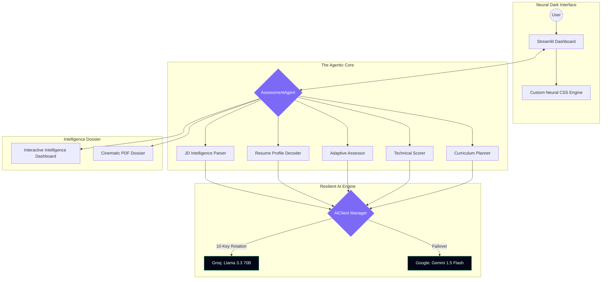

<p align="center">
  
  
  
  
</p>

# ◈ NeuralHire: Autonomous Skill Assessment Engine

### *Bridging the Hiring Gap through High-Fidelity Intelligence Probes and Dynamic Learning Synthesis.*

---


*The NeuralHire Landing Page: A cinematic gateway to autonomous technical evaluation.*

---

## 📌 The "Hiring Gap" Problem
Traditional recruitment is plagued by static data and zero-feedback loops:
*   **Recruiters** waste 60% of their time screening resumes that exaggerate skills.
*   **Candidates** suffer from "Black Hole" applications with no guidance on how to improve.
*   **The Result:** A friction-heavy market where talent is misaligned and growth is stagnant.

**NeuralHire** acts as the missing link. It doesn't just "match" keywords; it **validates** technical depth through adaptive AI-led interviews and **diagnoses** specific gaps to build a 12-week roadmap for candidate success.

---

## 🏗️ System Architecture: The Agentic Brain

NeuralHire follows a modular, agent-driven architecture where a central orchestrator manages specialized intelligence units.



---

## ✨ Key Features

### ⚡ Sub-Second Intelligence Probes
Powered by **Groq**, the agent conducts live technical screens with sub-500ms latency, making the assessment feel like a real-time conversation with a Senior Engineer.

### 🔄 Multi-Key Resiliency Engine
The `AIClient` features a production-grade **10-key rotation system** with automatic failover. If a Groq key hits a rate limit, the system instantly switches to Gemini, ensuring zero downtime during high-stakes evaluations.

### 🎨 Neural Dark Visual System
A bespoke UI built with **Glassmorphism**, HSL-tailored color palettes, and subtle CSS micro-animations. It transforms a standard form into an immersive "Intelligence Scan."

### 📊 Cinematic Intelligence Dossier
Beyond simple scoring, the system synthesizes a **12-week strategic roadmap**. It curates documentation, YouTube resources (Easy/Medium/Hard), and hands-on milestones tailored to the candidate's specific gap.

---

## 🛠️ Technical Deep-Dive

### The Pipeline
1.  **Vector Ingestion**: `P_JD` and `P_RES` convert unstructured PDFs into high-dimensional skill profiles using Pydantic validation.
2.  **Adaptive Probing**: `ASS` generates targeted, scenario-based questions that drill deeper into claimed expertise.
3.  **Proficiency Scoring**: `SCO` applies a weighted formula `(Gap * 0.6) + (Criticality * 0.4)` to determine priority areas.
4.  **Synthesis**: `PLN` curates a multi-modal learning plan, mapping discovered gaps to specific industry resources.

### Tech Stack
*   **Core**: Python 3.12, Streamlit 1.56
*   **AI**: Groq (Llama 3.3 70B), Google Gemini 1.5 Flash
*   **Validation**: Pydantic V2 (Strict Schema Enforcement)
*   **PDF Engine**: PyMuPDF, ReportLab (High-fidelity generation)
*   **Observability**: Loguru (Structured async logging)

---

## 🧪 Demo / Intelligence Dashboard


*The Intelligence Dashboard: A centralized view of candidate proficiency and their personalized learning journey.*

---

## 🚀 Installation & Deployment

### Local Setup
1. **Clone & Venv**:
   ```bash
   git clone https://github.com/Yashthakre-07/Catalyst_Yash_Thakre.git
   cd Catalyst_Yash_Thakre
   python -m venv venv
   source venv/bin/activate # Windows: venv\Scripts\activate
   ```
2. **Install Dependencies**:
   ```bash
   pip install -r requirements.txt
   ```
3. **Environment**: Create a `.env` file with your `GROQ_API_KEY` and `GEMINI_API_KEY`.
4. **Launch**:
   ```bash
   streamlit run main.py
   ```

### Production Deployment
NeuralHire is optimized for **Streamlit Cloud** and **Docker**. The `AIClient` is designed to be **Stateless and Robust**, perfectly suited for serverless deployment.

---

<p align="center">
  <b>NeuralHire</b> • Engineered for the Future of Talent Acquisition.
</p>
