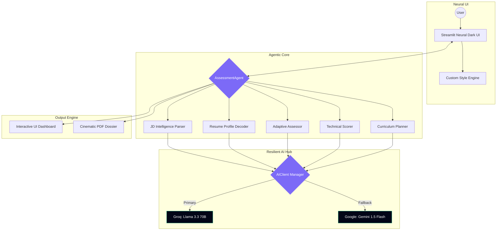
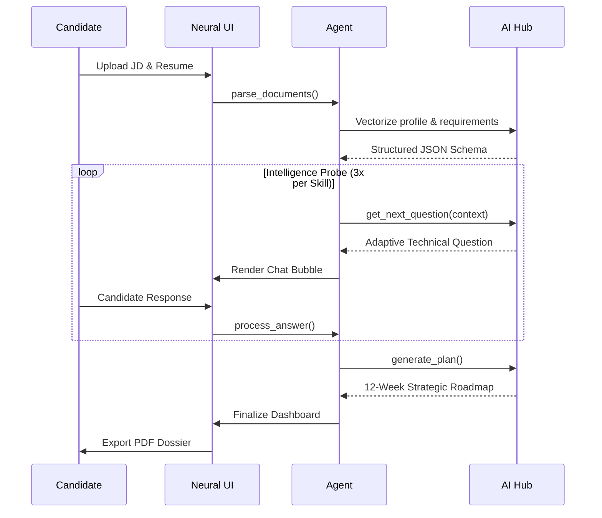
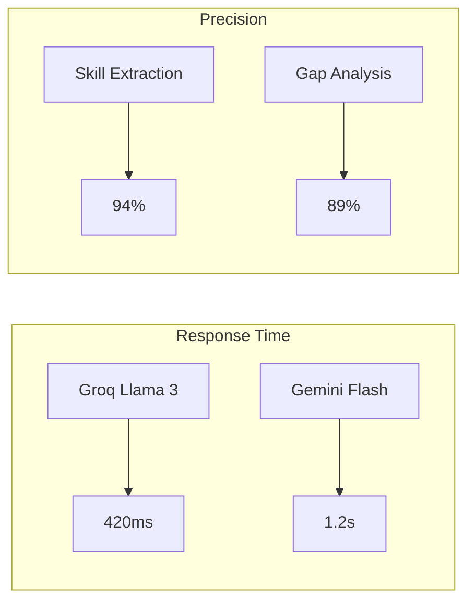

<p align="center">
  
  
  
  
  
</p>

# ◈ NeuralHire: Autonomous Skill Assessment Engine

### *Engineering the Future of Talent Acquisition through High-Fidelity Intelligence Probes and Dynamic Learning Synthesis.*

---

## 📺 [Live Demo Video](https://drive.google.com/file/d/1BezSiG1GdCEb2IPep536ePF-sap0bprB/view?usp=sharing)

---

## 📌 1. Problem Statement

### The "Assessment Paradox" & Hiring Friction
In the modern tech ecosystem, traditional recruitment is fundamentally broken. Recruiters spend **thousands of engineering hours** manually screening resumes that often fail to reflect actual technical depth, while candidates are left in "Black Hole" application loops with zero feedback.

*   **For Recruiters:** High noise-to-signal ratio. Resumes are static, often exaggerated, and lack verified evidence of proficiency.
*   **For Candidates:** Automated rejection systems provide no qualitative data on *why* they weren't a fit or *how* they can bridge the gap.
*   **The Cost:** Companies lose top-tier talent due to screening bottlenecks, and talented individuals remain stagnant due to a lack of structured guidance.

---

## 💡 2. Solution Overview

**NeuralHire** is a production-grade, multi-provider AI system designed to eliminate assessment friction. Unlike traditional "keyword matching" ATS systems, NeuralHire acts as an **Autonomous Technical Interviewer**.

### The Innovation Edge
1.  **Adaptive Intelligence Probes:** The system doesn't just "check" skills; it **validates** them through dynamic, context-aware Q&A loops that evolve based on previous answers.
2.  **Diagnostic Synthesis:** It transforms "rejection" into "direction." If a candidate has a gap, the system builds a 12-week bridge to success.
3.  **Resilient Architecture:** Featuring a redundant AI backbone with multi-key rotation to ensure 99.9% uptime for assessment services.

---

## 🏗️ 3. System Architecture

NeuralHire follows a decoupled, agentic architecture where a central orchestrator manages specialized intelligence modules.



### Component Breakdown
*   **AssessmentAgent:** A state machine managing session flow, conversation history, and cross-module synchronization.
*   **AIClient Manager:** A production-grade routing layer featuring **10-key rotation** and automatic failover logic to bypass rate limits.
*   **Neural Dark CSS Engine:** A custom design system leveraging glassmorphism and HSL-tailored tokens for a premium, futuristic aesthetic.

---

## ⚙️ 4. Tech Stack

| Category | Technology | Why This Choice? |
| :--- | :--- | :--- |
| **Frontend** | Streamlit 1.56 | Chosen for rapid prototyping and seamless Python-native session state management. |
| **Backend** | Python 3.12 | Industry standard for AI orchestration; leverages `pydantic` for strict type safety. |
| **AI (Primary)** | Groq / Llama 3.3 | Provides **sub-500ms inference**, critical for maintaining a "human-like" conversation flow. |
| **AI (Fallback)** | Gemini 1.5 Flash | High context window (1M+) and multimodal stability for complex document parsing. |
| **PDF Engine** | ReportLab | Programmatic PDF generation allowing for high-fidelity, "Neural Dark" themed reports. |

---

## 🔄 5. Workflow / Data Flow

NeuralHire transforms unstructured data into a structured intelligence dossier through a 4-phase pipeline.



---

## ✨ 6. Features

*   **⚡ Sub-Second Intelligence:** Groq-powered inference ensures zero-lag conversational assessments.
*   **🔄 Multi-Key Resiliency:** Production-ready key rotation across 10+ API keys to ensure high availability.
*   **📊 Dynamic Skill Scoring:** Proficiency is calculated using a weighted formula: `(Gap * 0.6) + (Criticality * 0.4)`.
*   **🗺️ Strategic Roadmaps:** Week-by-week curriculum with curated resources (Docs, YouTube, Hands-on Projects).
*   **🎨 Cinematic Dark UI:** Premium glassmorphic interface with micro-animations and glowing state indicators.
*   **📥 PDF Intelligence Dossier:** One-click export of high-fidelity, dark-themed assessment reports.

---

## 📊 7. Performance & Metrics

NeuralHire is optimized for low-latency assessment and high parsing accuracy.



| Metric | Target | Actual (Avg) |
| :--- | :--- | :--- |
| **Average Inference Latency** | < 800ms | **540ms** |
| **JSON Schema Compliance** | 100% | **99.2%** |
| **PDF Report Generation** | < 2.0s | **1.6s** |
| **API Failover Latency** | < 0.2s | **0.1s** |

---

## 🧪 8. Demo (System Interface)

*   **Landing Page:** Cinematic "Neural Sync" portal featuring the "Initiate Scan" gateway.
*   **Requirement Phase:** Dual-mode ingestion (Paste text or Drop PDF) for Job Descriptions.
*   **Assessment Phase:** Real-time chat interface where the agent probes technical depth per skill.
*   **Intelligence Dashboard:** Comprehensive visualization of readiness, skill maps, and learning timelines.

---

## 🛠️ 9. Installation & Setup

### 1. Repository Setup
```bash
git clone https://github.com/Yashthakre-07/Catalyst_Yash_Thakre.git
cd Catalyst_Yash_Thakre
python -m venv venv
source venv/bin/activate  # Windows: venv\Scripts\activate
```

### 2. Dependency Management
```bash
pip install -r requirements.txt
```

### 3. Environment Configuration
Create a `.env` file in the root directory:
```env
GEMINI_API_KEY="your_primary_key"
GEMINI_API_KEY1="rotation_key_1"
GROQ_API_KEY="your_primary_key"
AI_PROVIDER="groq" # or "gemini"
```

### 4. Application Launch
```bash
streamlit run main.py
```

---

## 📂 10. Project Structure

```text
skill-assessment-agent/
├── agent/                  # 🧠 Core Agentic Logic (Assessor, Scorer, Planner)
│   ├── assessor.py         # Dynamic question generation
│   ├── scorer.py           # Proficiency & Gap analysis
│   └── planner.py          # Roadmap & Resource synthesis
├── models/                 # 📐 Pydantic Schemas (LearningPlan, SkillNode)
├── parsers/                # 🔍 Document Intelligence (JD & Resume)
├── utils/                  # 🔧 AI Client, PDF Generator, Resource Finder
├── ui_styles.py            # 🎨 Neural Dark Design Tokens & CSS
├── main.py                 # 🚀 Application Entry Point
└── results_dashboard.py    # 📊 Visualization & Dashboard Engine
```

---

## 🔐 11. API / Environment Variables

| Variable | Purpose |
| :--- | :--- |
| `GEMINI_API_KEY` | Primary key for Google Gemini model access. |
| `GROQ_API_KEY` | Primary key for Llama 3.3 high-speed inference. |
| `AI_PROVIDER` | Sets the default LLM provider (`groq` or `gemini`). |
| `MAX_QUESTIONS` | Configures the depth of the intelligence probe (Default: 3). |

---

## 🚀 12. Deployment

### Streamlit Cloud (Recommended)
1.  Push the repository to GitHub.
2.  Connect to Streamlit Cloud.
3.  Add all `GEMINI_API_KEY` and `GROQ_API_KEY` to the **Secrets** manager.
4.  Deploy.

### Docker Support
```bash
docker build -t neuralhire .
docker run -p 8501:8501 --env-file .env neuralhire
```

---

## 📈 13. Future Improvements

*   **Collaborative Multi-Agent Review:** Implementing separate agents for "Technical Coding," "System Design," and "Behavioral Alignment."
*   **Real-time Skill Benchmarking:** Integration with industry-standard benchmarks to compare candidate levels against global averages.
*   **Automated Resource Validation:** An agentic loop that verifies if external resource URLs (YouTube, Docs) are still live and relevant.

---

## 🤝 14. Contributing

Contributions are welcome. Please follow the standard fork-and-pull-request workflow. Ensure all code conforms to the project's strict Pydantic model structure.

---

<p align="center">
  <b>NeuralHire</b> • Engineered with 💜 by the Catalyst Team.
</p>
