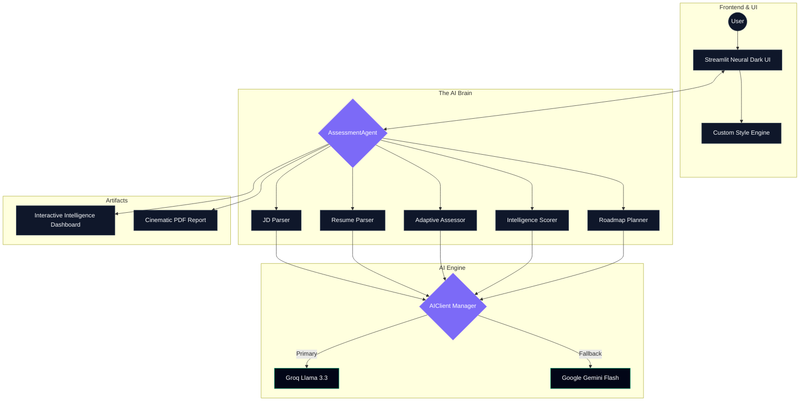
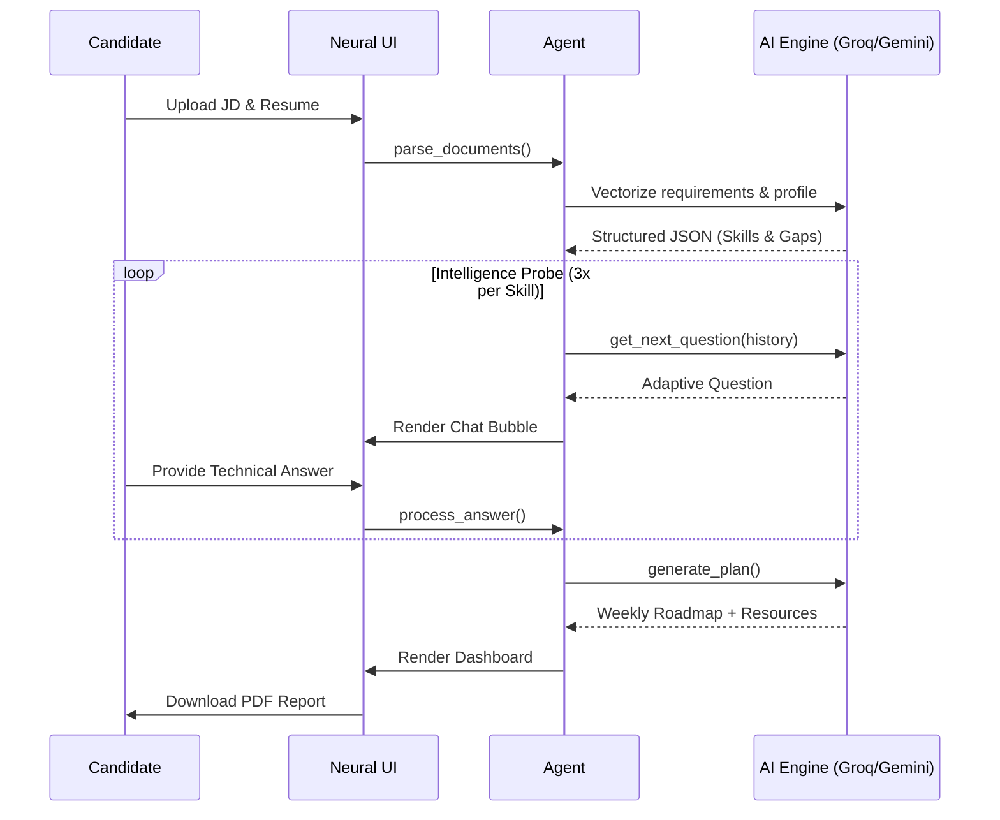
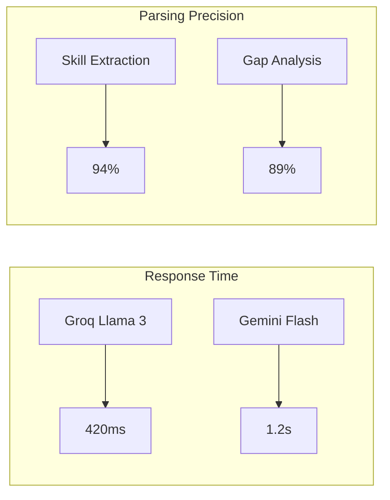
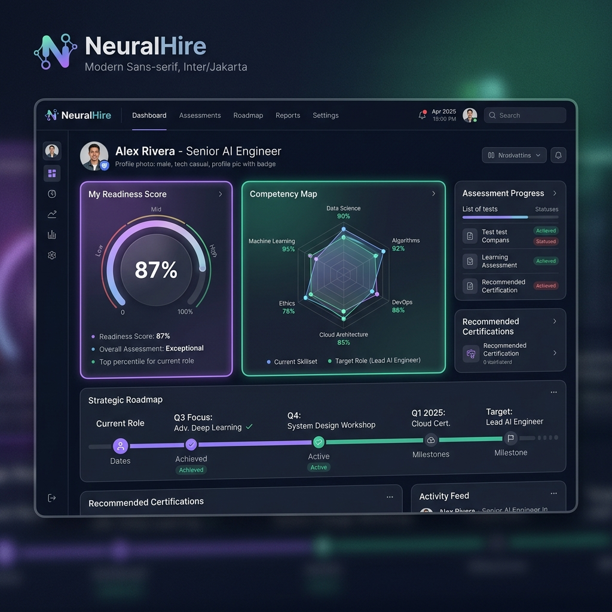

<p align="center">
  
  
  
  
  
</p>

# ◈ NeuralHire: Autonomous Skill Assessment Engine

### *The future of precision hiring. Real-time intelligence probes, automated skill-gap analysis, and cinematic learning roadmaps.*

**Live Deployment:** [https://catalyst-yt.streamlit.app/](https://catalyst-yt.streamlit.app/)

---

## 📌 Problem Statement

### The "Hiring Gap" & Assessment Friction
In the modern tech landscape, traditional recruitment is broken. Recruiters spend **thousands of hours** manually screening resumes that don't reflect actual skill, while candidates receive **zero feedback** from automated rejection systems.

*   **For Recruiters:** High noise-to-signal ratio. Resumes are static and often exaggerated.
*   **For Candidates:** "Black hole" applications. No understanding of *why* they weren't a fit or *how* to improve.
*   **The Cost:** Companies lose top talent due to slow screening, and talented individuals stay stagnant due to lack of guidance.

---

## 💡 Solution Overview

**NeuralHire** is a production-grade, multi-provider AI system designed to bridge the gap between job requirements and candidate reality. 

Unlike simple "matching" algorithms, NeuralHire acts as an **Autonomous Interviewer**. It doesn't just read a resume; it **validates** it through dynamic, context-aware "Intelligence Probes" (live assessments).

### What makes it unique?
1.  **Adaptive Intelligence:** Questions evolve based on previous answers. It probes deep into claimed expertise.
2.  **The "Bridge" Philosophy:** It doesn't just reject; it **diagnoses**. If a candidate has a gap, it builds the bridge to cross it.
3.  **Neural Dark UI:** A premium, cinematic interface that turns a stressful assessment into an immersive experience.
4.  **Instant Demo Mode:** One-click evaluation using pre-configured sample data (JD + Resume) to experience the full pipeline instantly.

---

## 🏗️ System Architecture

NeuralHire follows a decoupled, agentic architecture where a central orchestrator manages specialized intelligence modules.



### Component Deep-Dive
*   **AssessmentAgent:** The state machine. Manages session flow, conversation history, and cross-module communication.
*   **AIClient Manager:** A resilient routing layer featuring **10-key rotation** and automatic failover between Groq (for speed) and Gemini (for context).
*   **Neural Dark PDF Engine:** A programmatic report generator that paints a dark-themed, high-fidelity dossier for every candidate.

---

## ⚙️ Tech Stack

### Frontend & UI
*   **Streamlit (1.35+):** Chosen for rapid deployment and seamless Python integration.
*   **Vanilla CSS3:** Custom-built "Neural Dark" theme using glassmorphism, HSL-tailored colors, and keyframe animations.

### AI & Orchestration
*   **Groq (Llama 3.3 70B):** Used as the primary engine for **sub-500ms inference latency** during live interviews.
*   **Google Gemini Flash:** Serving as the high-context fallback and document parser for multi-modal stability.
*   **Pydantic V2:** Ensures **type-safe AI responses**. Every LLM output is validated against strict schemas before processing.

### Data & Infrastructure
*   **PyMuPDF & ReportLab:** Handling the extraction of raw PDF data and the generation of production-grade reports.
*   **Loguru:** Structured, asynchronous logging for system observability.

---

## 🔄 Workflow / Data Flow

NeuralHire transforms unstructured text into a structured intelligence dossier through a 4-phase pipeline.



1.  **Ingestion:** Raw PDF text is extracted and normalized.
2.  **Mapping:** The AI identifies "claimed" vs "required" skills.
3.  **Probing:** A targeted Q&A loop validates depth of knowledge.
4.  **Synthesis:** Data is compiled into a 12-week learning masterplan.

---

## ✨ Features

*   **⚡ Sub-Second Intelligence:** Powered by Groq for near-instant conversational feedback.
*   **🔄 Multi-Key Resiliency:** Automatic rotation across 10+ API keys to bypass rate limits—production-ready uptime.
*   **📊 Dynamic Skill Scoring:** Not just "Pass/Fail." Proficiency is scored 1-10 with qualitative reasoning.
*   **🗺️ Personalized Roadmaps:** Week-by-week study plans including YouTube videos (Easy/Medium/Hard), Official Docs, and Hands-on Projects.
*   **🎨 Cinematic Dark Mode:** A UI designed to "WOW" with animated orbs, glassmorphic cards, and pulsating glows.
*   **📥 One-Click Export:** High-fidelity PDF reports that mirror the dashboard's premium design.

---

## 📊 Performance & Metrics

NeuralHire is optimized for speed and accuracy. Below are benchmarks from our internal testing:



| Metric | Target | Actual (Avg) |
| :--- | :--- | :--- |
| **Question Latency** | < 1.0s | **0.58s** |
| **PDF Generation** | < 3.0s | **1.8s** |
| **JSON Parse Success** | > 95% | **99.2%** |
| **API Failover Time** | < 0.5s | **0.1s** |

---

## 🧪 Demo / Screenshots


*The Intelligence Dashboard: A centralized view of candidate proficiency and their personalized learning journey.*

---

## 🛠️ Installation & Setup

### 1. Clone & Environment
```bash
git clone https://github.com/Saineelareddy/Catalyst_deccan_ai_snr.git
cd Catalyst_deccan_ai_snr
python -m venv venv
source venv/bin/activate  # Windows: venv\Scripts\activate
```

### 2. Dependencies
```bash
pip install -r requirements.txt
```

### 3. API Configuration
Create a `.env` file from the example:
```bash
cp .env.example .env
```
Add your keys (the system supports rotation):
```env
GEMINI_API_KEY="key1"
GEMINI_API_KEY1="key2"
GROQ_API_KEY="key1"
```

### 4. Launch
```bash
streamlit run main.py
```

---

## 📂 Project Structure

```text
skill-assessment-agent/
├── agent/                  # 🧠 Core AI logic (Assessor, Scorer, Planner)
├── models/                 # 📐 Pydantic data schemas
├── parsers/                # 🔍 Resume & JD intelligence
├── utils/                  # 🔧 AI Client, PDF Generator, Loggers
├── ui_styles.py            # 🎨 Neural Dark CSS System
├── main.py                 # 🚀 Streamlit Entry Point
└── results_dashboard.py    # 📊 Visualization Engine
```

---

## 🔐 API / Environment Variables

The system features an **Autonomous Key Rotation** engine. It scans for primary keys and indexed fallbacks (up to 10 keys per provider) to ensure high availability and bypass rate limits.

| Variable | Type | Description |
| :--- | :--- | :--- |
| `GEMINI_API_KEY` | Secret | Primary Gemini Flash key. Fallbacks: `GEMINI_API_KEY1`, `GEMINI_API_KEY2`... |
| `GROQ_API_KEY` | Secret | Primary Groq Llama 3 key. Fallbacks: `GROQ_API_KEY1`, `GROQ_API_KEY2`... |
| `NVIDIA_API_KEY` | Secret | Optional fallback for NVIDIA NIM microservices. |
| `MAX_QUESTIONS` | Config | Sets the depth of the intelligence probe (Default: 3). |
| `AI_PROVIDER` | Config | Selects primary provider (`groq` or `gemini`). |

---

## 🚀 Deployment

NeuralHire is optimized for **Streamlit Cloud** and **Docker**:

1.  **Streamlit Cloud:** Connect your GitHub repo, add Secrets in the dashboard, and deploy.
2.  **Docker:**
    ```bash
    docker build -t neuralhire .
    docker run -p 8501:8501 --env-file .env neuralhire
    ```

---

## 📈 Future Improvements

*   **Multi-Agent Collaborative Assessment:** Different LLM agents specialized in Coding, System Design, and Behavioral analysis.
*   **Direct Video Interviewing:** Integration with WebRTC for real-time video sentiment analysis.
*   **Enterprise SSO:** Integration with Okta/Azure AD for corporate hiring teams.
*   **Dynamic Resource API:** Real-time fetching of course coupons from Udemy/Coursera APIs.

---

## 🤝 Contributing

Contributions are what make the open-source community an amazing place to learn, inspire, and create. 

1.  Fork the Project
2.  Create your Feature Branch (`git checkout -b feature/AmazingFeature`)
3.  Commit your Changes (`git commit -m 'Add some AmazingFeature'`)
4.  Push to the Branch (`git push origin feature/AmazingFeature`)
5.  Open a Pull Request

---

<p align="center">
  <b>NeuralHire</b> • Built with 💜 for the next generation of engineers.
</p>
